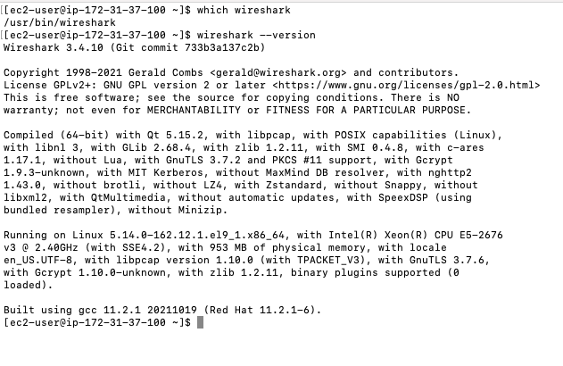
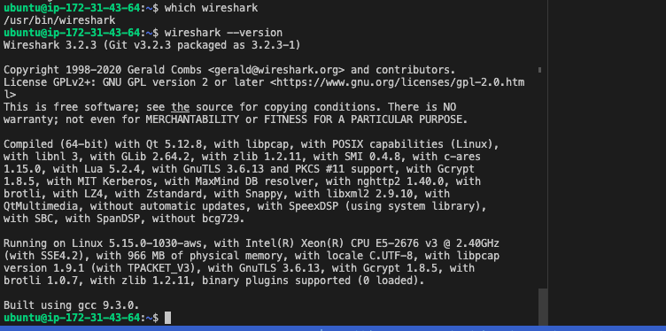
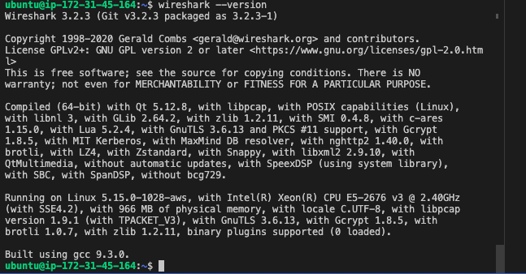

## PROJECT 11: Ansible – Automate Project 7 to 10

1. INSTALL AND CONFIGURE ANSIBLE ON EC2 INSTANCE

'sudo apt update'

'sudo apt install ansible'

- Check your Ansible version by running ansible --version

- Configure Jenkins build job to save your repository content every time you change it – this will solidify your Jenkins configuration skills acquired in Project 9.

- Test your setup by making some change in README.MD file in master branch and make sure that builds starts automatically and Jenkins saves the files (build artifacts) in following folder

'ls /var/lib/jenkins/jobs/ansible/builds/<build_number>/archive/'

2. Step 2 – Prepare your development environment using Visual Studio Code

3. BEGIN ANSIBLE DEVELOPMENT

- In your ansible-config-mgt GitHub repository, create a new branch that will be used for development of a new feature.

- Create a directory and name it playbooks – it will be used to store all your playbook files.

- Create a directory and name it inventory – it will be used to keep your hosts organised.

- Within the playbooks folder, create your first playbook, and name it common.yml

- Within the inventory folder, create an inventory file (.yml) for each environment (Development, Staging Testing and Production) dev, staging, uat, and prod respectively.

4. Set up an Ansible Inventory

'eval `ssh-agent -s`'

'ssh-add <path-to-private-key>'

'ssh -A ubuntu@public-ip'

- Update your inventory/dev.yml file with this snippet of code:

5. CREATE A COMMON PLAYBOOK

- Update your playbooks/common.yml file with following code:

6. Update GIT with the latest code

- Commit your code into GitHub:

- Create a Pull request (PR)

- Head back on your terminal, checkout from the feature branch into the master, and pull down the latest changes.

- Once your code changes appear in master branch – Jenkins will do its job and save all the files (build artifacts) to /var/lib/jenkins/jobs/ansible/builds/<build_number>/archive/ directory on Jenkins-Ansible server.

7. Run first Ansible test

'cd ansible-config-mgt'

'ansible-playbook -i inventory/dev.yml playbooks/common.yml'

